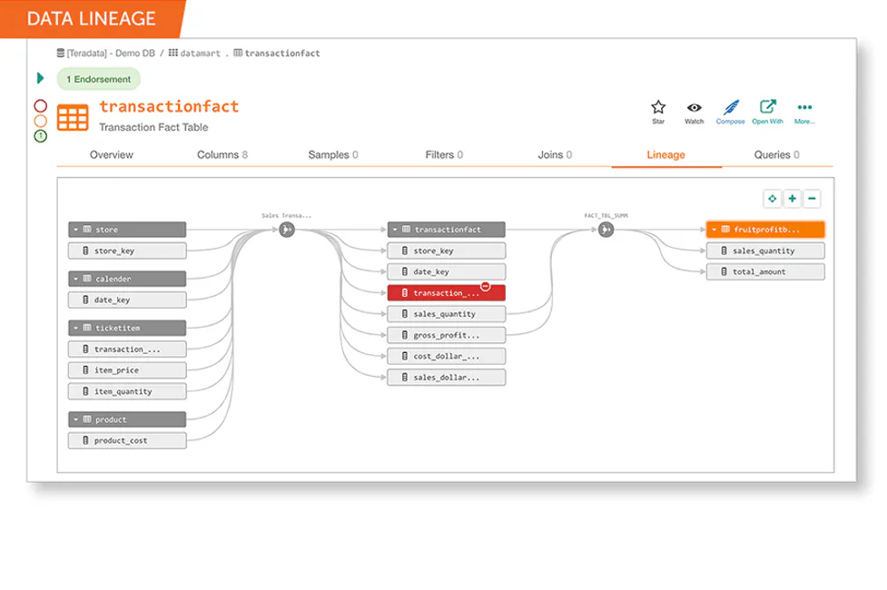

<div id="top"></div>
<!-- PROJECT LOGO -->
<br />
<div align="center">
  <a href="containers">
    
  </a>
</div>
  
<!-- TABLE OF CONTENTS -->
<a name="TOP"></a>
<details>
  <summary>Table of Contents</summary>
  <ol>
    <li>
      <a href="#about-the-project">About The Project</a>
       <ul>
        <li><a href="#architecture">Architecture</a></li>
        <li><a href="#important-links">Important Links</a></li>
      </ul>
    </li>
    <li>
      <a href="#getting-started">Getting Started</a>
      <ul>
        <li><a href="#prerequisites">Prerequisites</a></li> 
        <ul>
            <li><a href="#services-urls">Services URLs</a></li>
        </ul>              
        <li><a href="#spLine-demo">SpLine Demo</a></li>               
        <li><a href="#run-express-ui">Run Express UI</a></li>               
        <li><a href="#jupyter-notebook-dashboard">Jupyter Notebook Dashboard</a></li>               
        <li><a href="#add-project-to-github">Add project to github</a></li>               
      </ul>
    </li>
  </ol>
</details>

## About The Project
**DRE Data Lineage for MDE**
- The idea behind the project is to 

### Important Links

- Data Lineage 
	- https://www.imperva.com/learn/data-security/data-lineage/
	- https://liangjunjiang.medium.com/design-a-end-to-end-data-lineage-solution-7784cdfc9e17
	

- Spline (SPark LINEage)
	- https://absaoss.github.io/spline/
	- https://github.com/AbsaOSS/spline-getting-started
	- https://github.com/AbsaOSS/spline-spark-agent
	- https://aws.amazon.com/blogs/big-data/build-data-lineage-for-data-lakes-using-aws-glue-amazon-neptune-and-spline/
	- https://index.scala-lang.org/absaoss/spline-spark-agent
	- Example : https://www.capitalone.com/tech/software-engineering/spline-spark-data-lineage/
	
- Lineage
	- https://openlineage.io
	- https://openlineage.io/integration
	- https://github.com/OpenLineage/OpenLineage
	
- Docker (bitnami)
    - https://hub.docker.com/search?q=bitnami
        - https://hub.docker.com/r/bitnami/spark
        - https://github.com/bitnami/containers/tree/main/bitnami
    - https://bitnami.com/stacks/containers


[Back to Top](#TOP)

### Architecture
**Initial Software Architecture Design**
* [Lineage](https://www.alation.com/blog/what-is-data-lineage/)

<div align="center">
  <a href="https://miro.com/app/board/uXjVPcXm69o=/">
    
  </a>
</div>

---

## Getting Started

### Prerequisites 

- **Install Docker**
    * [Docker on Mac](https://docs.docker.com/desktop/install/mac-install/)
    * [Docker on Windows](https://docs.docker.com/desktop/install/windows-install/)
- **Install Docker Compose**
    * [Docker Compose](https://docs.docker.com/compose/install/)

- **SpLine Prerequisites (SPark LINEage)**
    * .env 
        * Spline Web UI: http://localhost:{SPLINE_UI_PORT}
        * Spline Server: http://localhost:{SPLINE_REST_PORT}
        * Example :
            - SPLINE_REST_PORT=9080
            - SPLINE_UI_PORT=9093
- **Hadoop and Hive Prerequisites** by [Big Data Europe](https://github.com/big-data-europe)
    * hadoop-hive.env
       
- **General Execution to run all images in containers - You NEED TO RUN Container at the Begining** 

```
> cd <Parent_Path_To_Your_Application>/docker-containers
> docker-compose down --remove-orphans
> docker-compose up -d --remove-orphans
``` 

- **Reducing the consumption of the `vmmem` process in windows**
```
Open CMD CLI Terminal or Powershell 
> wsl --shutdown
> notepad "$env:USERPROFILE/.wslconfig"

[wsl2]
memory=10GB   # Limits VM memory in WSL 2 up to 3GB
processors=8 # Makes the WSL 2 VM use two virtual processors

> C:\Users\your-username\.wslconfig

Then restart 
1. Docker Desktop
2. Restart containers 
    (docker-compose down --remove-orphans 
    then 
    docker-compose up -d --remove-orphans)

```

#### Services URLs 
1. Airflow : http://localhost:8081
2. Spark 3.1 : http://localhost:9090/
3. Hadoop/Hive:
    - Name Node: http://localhost:50070/ 
    - Data Node: http://localhost:50075/ 
    - Hive metastore: http://localhost:9083/
    - Hive server: jdbc:hive2://localhost:10000
4. Presto: http://localhost:8082/
5. Spline: 
    - UI: http://localhost:9093
    - REST:  http://localhost:9080
6. MongoDB: mongodb://mongo:27017
7. MongoDB Express UI: http://localhost:3030/
8. Postgresql: 
    - Host=localhost
    - port=5432
    - Databases 
        - Default Database=postgres
        - POSTGRESQL_DATABASE=bitnami_airflow 
    - POSTGRESQL_USERNAME=bn_airflow
    - POSTGRESQL_PASSWORD=bitnami1
9. Express UI: http://localhost:3000/ & http://localhost:3000/users
10. Jupyter : http://localhost:10888/

[Back to Top](#TOP)

---
 
### SpLine Demo 
**using CMD/VIM terminal**

- The way to copy artifacts into the container 
`` > docker cp <src-path> <container>:<dest-path>  ``

- Steps
```
docker cp my-spark-job docker-containers_spark-worker_1:/opt/bitnami/spark/

docker exec -u root -it docker-containers_spark-worker_1 /bin/bash
$> chmod 774 -R my-spark-job/
$> chown 1001:1001 -R my-spark-job/
$> **OPTIONAL STEP** apt update -y && apt upgrade -y && apt-get install -y telnet && apt install -y iputils-ping && apt install -y net-tools && apt install -y lsof
$> exit

docker exec -it docker-containers_spark-worker_1 /bin/bash
$> cd my-spark-job
$> spark-submit \
  --packages za.co.absa.spline.agent.spark:spark-3.1-spline-agent-bundle_2.12:0.7.10 \
  --conf spark.sql.queryExecutionListeners=za.co.absa.spline.harvester.listener.SplineQueryExecutionListener \
  --conf spark.spline.producer.url=http://172.17.0.1:9080/producer \
  my_spark_job.py
  
```
[Back to Top](#TOP)

### Run Express UI
**using CMD/VIM terminal**

1. Execute 
```docker-compose exec express node
docker-compose exec express npm ls
docker-compose exec express npm install bootstrap --save
docker-compose restart express
```
2. After 5 seconds 
 - Open Express URL and Port : **http://localhost:3000/** you should see message "Welcome to Express"
 - Open another URL : **http://localhost:3000/users** you should see message "respond with a resource"
 
### Jupyter Notebook Dashboard 
To open the Notebook URL
1. **Option 1** To retrieve the Notebook URL with Token.
``docker logs docker-containers_jupyter_1`` this will print something like **http://127.0.0.1:8888/lab?token=cc82XXXXXXXX**
Go to your browser and use the same url but change the port with the exposed one in the [.env] file JUPYTER_PORT=10888 "i.e. http://127.0.0.1:10888/lab?token=cc82XXXXXXXX"

2. **Option 2** Open the URL with exposed port and generate a new password instantly to overcome token part
``http://127.0.0.1:10888`` 

3. **Option 3** List URLs of running servers with their tokens, which you can copy and paste into your browser.
```
> http://127.0.0.1:10888
> jupyter server list

```

[Back to Top](#TOP)

---

### Add project to github
#### Steps to add existing application to git
Just for your info
- **In Terminal, change the current working directory to your local project**
1. Initialize the local directory as a Git repository.
``git init``

2. Add the files in your new local repository. This stages them for the first commit.
``git add .``

3. Commit the files that you've staged in your local repository.
``git commit -m 'First commit'``

4. Copy remote repository URL field from your GitHub repository, in the right sidebar, copy the remote repository URL.
In Terminal, add the URL for the remote repository where your local repostory will be pushed.
  ``git remote add origin <remote repository URL>``

5. Sets the new remote:
``git remote -v``

6. Push the changes in your local repository to GitHub.
``git push origin master``

7. Pushes the changes in your local repository up to the remote repository you specified as the origin


[Back to Top](#TOP)